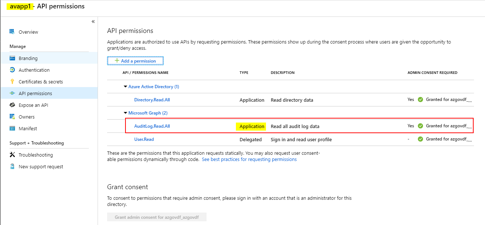
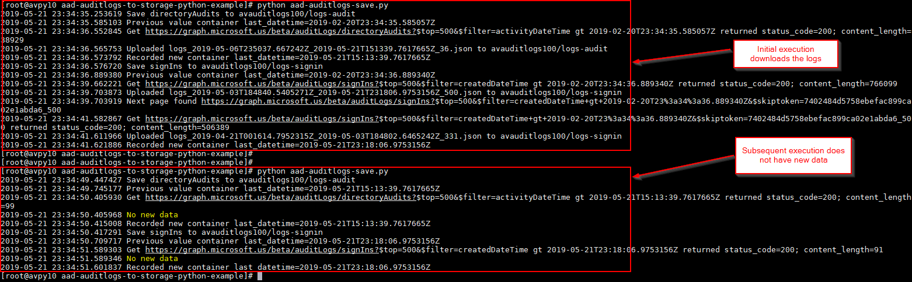
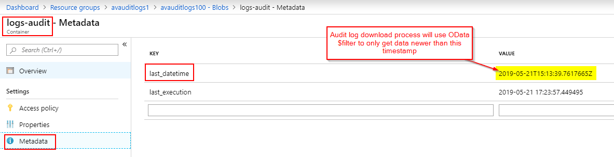
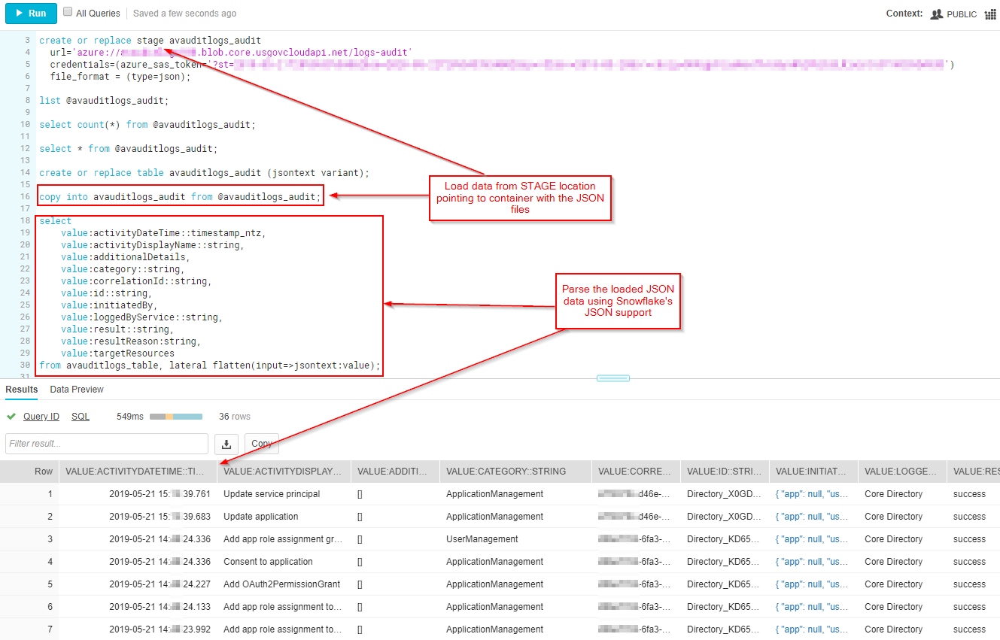

# Azure Active Directory Audit Logs to Storage - Python Example
Simple example showing how to invoke Azure Active Directory reporting API from Python, pull audit logs and sign in logs, upload them to storage, and optionally load into Snowflake tables for analysis.

In Azure public cloud, you can configure Azure Active Directory logs export to an Azure storage account using these [instructions](https://docs.microsoft.com/en-us/azure/active-directory/reports-monitoring/quickstart-azure-monitor-route-logs-to-storage-account).

As of May 2019, it is not yet possible to configure the same out-of-box export in Azure US Government cloud environment.

This sample code shows how to use [Azure Active Directory reporting APIs](https://docs.microsoft.com/en-us/azure/active-directory/reports-monitoring/concept-reporting-api) to pull the audit logs from Graph API and upload the resultant JSON files to Azure blob storage containers: one for [directoryAudits](https://docs.microsoft.com/en-us/graph/api/directoryaudit-list?view=graph-rest-beta&tabs=cs) (log-audit) and one for [signIns](https://docs.microsoft.com/en-us/graph/api/signin-list?view=graph-rest-beta&tabs=cs) (log-signin). 

NOTE: Download of signIns requires Azure Active Directory Premium license.

To use this sample, you will need to create a Service Principal (i.e. Azure AD application) and grant it permission to **Microsoft.Graph AuditLog.Read.All** as shown below. You also need to assign the same application data-plane **Storage Blob Contributor** role to the storage account into which logs will be saved. Storage account must be GPv2 to support OAuth bearer token authentication instead of shared key or SAS.


When process executes the first time, it downloads as many logs as it can within the last X days. On subsequent executions, the process tries to only download most recent data by keeping track of the last_datetime in the storage container metadata.


It keeps track of the latest downloaded records by storing the last record timestamp (last_datetime) as a key-value pair in container metadata.


After report data JSON is saved in blobs within the relevant containers in the Azure Storage account, we can parse and import the data into another system for analysis. In this example, I show how to load and parse the logs into [Snowflake](http://www.snowflake.net/) tables. 


## Sample Snowflake queries to load and parse the audit logs
```
use database TEST_DB;

// DirectoryAudits ==============================

create or replace stage avauditlogs_audit
  url='azure://MY_STORAGE.blob.core.usgovcloudapi.net/logs-audit'
  credentials=(azure_sas_token='?st=MY_SAS_TOKEN')
  file_format = (type=json);
  
list @avauditlogs_audit;

select count(*) from @avauditlogs_audit;

select * from @avauditlogs_audit;

create or replace table avauditlogs_audit (jsontext variant);

copy into avauditlogs_audit from @avauditlogs_audit;

select
    value:activityDateTime::timestamp_ntz,
    value:activityDisplayName::string,
    value:additionalDetails,
    value:category::string,
    value:correlationId::string,
    value:id::string,
    value:initiatedBy,
    value:loggedByService::string,
    value:result::string,
    value:resultReason:string,
    value:targetResources
from avauditlogs_table, lateral flatten(input=>jsontext:value);

// SignIns ======================================

create or replace stage avauditlogs_signin
  url='azure://MY_STORAGE.blob.core.usgovcloudapi.net/logs-signin'
  credentials=(azure_sas_token='?st=MY_SAS_TOKEN')
  file_format = (type=json);

list @avauditlogs_signin;

select count(*) from @avauditlogs_signin;

select * from @avauditlogs_signin;

create or replace table avauditlogs_signin (jsontext variant);

copy into avauditlogs_signin from @avauditlogs_signin;

select
    value:createdDateTime::timestamp_ntz,
    value:id::string,
    value:userDisplayName::string,
    value:userPrincipalName::string,
    value:userId::string,
    value:appDisplayName::string,
    value:appId::string,
    value:ipAddress::string,
    value:clientAppUsed::string,
    value:mfaDetail,
    value:correlationId::string,
    value:conditionalAccessStatus::string,
    value:appliedConditionalAccessPolicy,
    value:originalRequestId::string,
    value:isInteractive::string,
    value:tokenIssuerName::string,
    value:tokenIssuerType::string,
    value:deviceDetail,
    value:location,
    value:riskDetail::string,
    value:riskLevelAggregated::string,
    value:riskDuringSignIn::string,
    value:riskState::string,
    value:riskEventTypes,
    value:resourceDisplayName::string,
    value:resourceId::string,
    value:authenticationMethodsUsed::string,
    value:status,
    value:processingTimeInMilliseconds::string,
    value:networkLocationDetails::string
from avauditlogs_signin, lateral flatten(input=>jsontext:value);
```
